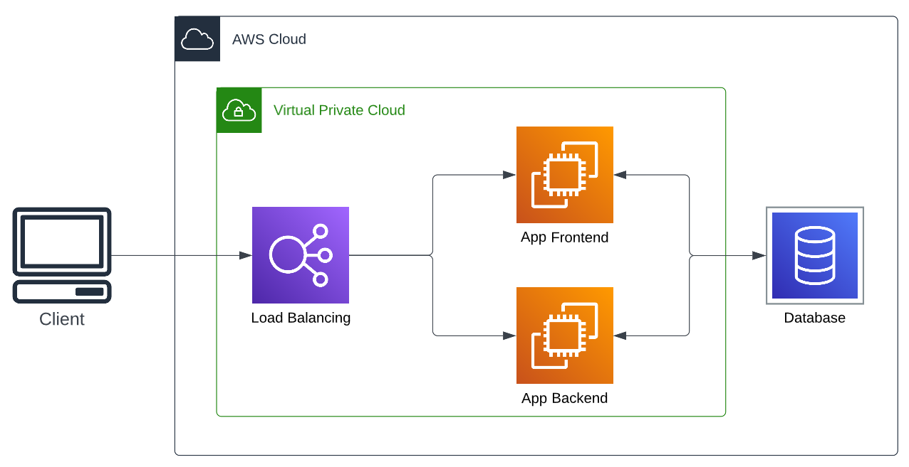
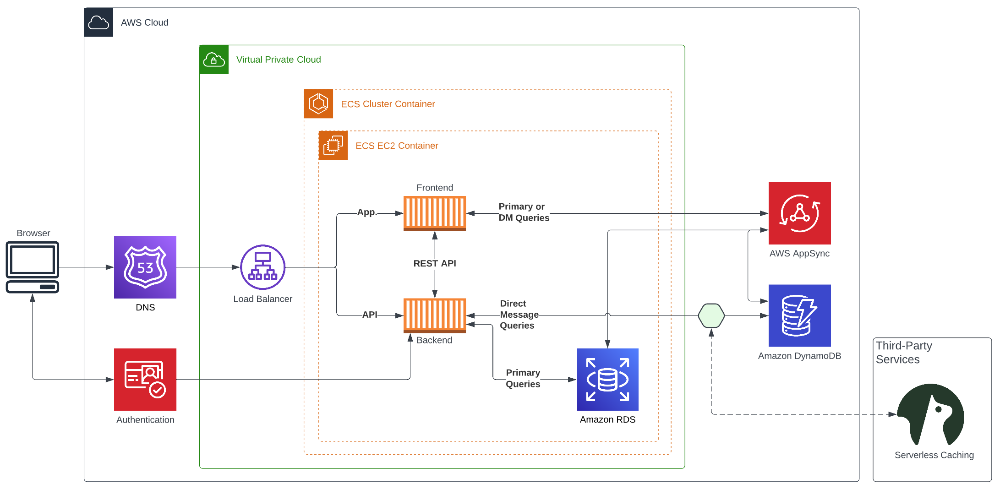

# Week 0 — Billing and Architecture

### Homework Submission

- watched learning videos on YouTube
- set up admin IAM user and AWS credentials
- installed AWS CLI and configured with AWS credentials
- created conceptual and logical architectural diagrams in Lucidchart
    - [**Share Link to Lucidchart Diagrams**](https://lucid.app/lucidchart/caa6fc8d-400c-4520-88fc-26f6ec38cd63/edit?viewport_loc=-987%2C-710%2C3751%2C1871%2C0_0&invitationId=inv_8325f28c-d420-40ba-b434-f3f8790e7a98)

NOT yet complete:
- use CloudShell
- create a Billing Alarm and Budget

---

### Conceptual Diagram

### Logical Diagram

